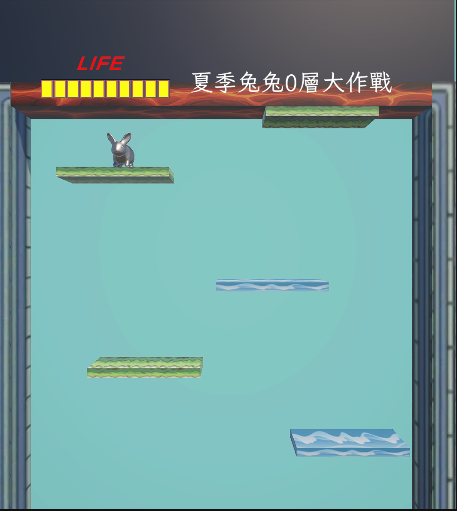

# 🐰 夏季兔兔大作戰 Summer Rabbit Battle

**summer-rabbit-battle** 是一款使用 **Unity 與 C#** 開發的垂直平台生存遊戲。
玩家以方向鍵操控兔子，在持續上升的平台之間移動與落下，利用草地補充生命值，避開海洋平台、頂端火焰與底部死亡線，挑戰更長的生存時間。

專案結合 3D 兔子模型、生命值介面、隨機平台、音效與重新遊玩流程，並在開始場景加入 **Vuforia Image Target** 展示。

---

## ✨ 功能特色

### 🐇 兔子角色與鍵盤操作

- 使用左右方向鍵控制角色水平移動。
- 透過 Rigidbody 重力與 Collider 處理落下、平台接觸及邊界碰撞。
- 搭配 3D 兔子模型，呈現固定視角的平台遊戲畫面。

### 🌱 隨機平台與持續移動

- 提供 **草地**與**海洋**兩種平台 Prefab。
- 平台持續向上移動，玩家需要適時離開目前的平台。
- 平台超過上方清除位置時，銷毀舊平台並在底部補入新平台。
- 新平台的類型與水平位置皆由 `FloorManager` 隨機選取。

### ❤️ 生命值與危險區域

- 每局開始時具有 **10 點生命值**，以畫面左上方的十格 LIFE 血條呈現。
- 從上方踩到草地可恢復 **1 點**生命值，上限為 10。
- 從上方踩到海洋平台會損失 **3 點**生命值。
- 觸碰頂端火焰時，若已記錄腳下平台，會扣除 **3 點**生命值並停用該平台的 Collider。
- 生命值歸零或穿過底部 `DeathLine`，即進入死亡流程。

### 🏆 生存計分與重新遊玩

- 遊戲期間每存活約 **5 秒**增加 1 層。
- 標題即時顯示「夏季兔兔 N 層大作戰」。
- 死亡時播放音效、暫停遊戲時間，並顯示「繼續遊戲」按鈕。
- 點擊「繼續遊戲」後重新載入遊戲場景，重設生命值與層數。

### 🔊 音效與按鈕互動

- 草地、海洋與頂端火焰分別配置碰撞音效。
- 角色具有獨立的死亡音效。
- 開始按鈕加入按壓縮放與平滑回彈效果。

### 📷 開始場景與 AR 展示

- `GameScene` 提供「開始遊戲」按鈕，載入主要遊戲場景 `SampleScene`。
- 開始場景包含 ARCamera 與 Vuforia Image Target，目標名稱為 `logo_johnny0523`。
- 目標辨識事件已連接粒子特效的播放與停止方法。
- 平台遊戲的主要操作位於 `SampleScene`，目前使用鍵盤輸入。

---

## 📸 遊戲畫面

以下為實際遊戲截圖，呈現兔子角色、LIFE 血條、層數文字、草地與海洋平台，以及頂端火焰。



---

## 🎮 操作方式與遊戲規則

### 操作方式

| 操作 | 功能 |
| --- | --- |
| 開始遊戲 | 在 `GameScene` 點擊按鈕，進入 `SampleScene` |
| `←`／`→` | 水平移動兔子，調整落下與接觸平台的位置 |
| 繼續遊戲 | 死亡後重新開始本局 |

### 平台與區域效果

| 物件／Tag | 效果 | 判定方式 |
| --- | --- | --- |
| 草地 `grass` | 回復 1 HP，上限 10 HP | 從平台上方接觸時觸發 |
| 海洋 `ocean` | 扣除 3 HP | 從平台上方接觸時觸發 |
| 頂端火焰 `ceiling` | 扣除 3 HP，停用記錄的平台 Collider | 已記錄腳下平台時觸發 |
| 底部死亡線 `DeathLine` | 直接進入死亡流程 | 穿過 Trigger 區域時觸發 |

目前的「層數」依**生存時間**累加。計分程式在累積時間超過 5 秒後增加 1 層，接著重新計時。

---

## 🛠 技術架構

### 開發環境與套件

| 技術／套件 | 版本 | 用途 |
| --- | --- | --- |
| Unity Editor | `6000.0.34f1`（Unity 6） | 場景編輯、物理系統與遊戲執行 |
| C# | Unity 腳本 | 角色控制、平台生成、生命值與場景切換 |
| Universal Render Pipeline | `17.0.3` | 遊戲場景渲染 |
| Input System | `1.11.2` | UI 輸入與事件系統 |
| Unity UI（uGUI） | `2.0.0` | 血條格、開始與重玩按鈕 |
| TextMesh Pro | Unity UI 文字元件 | LIFE、層數與按鈕文字 |
| Vuforia Engine | `11.1.3` 本機套件參照 | 開始場景的 Image Target 展示 |
| Rigidbody／Collider | Unity 3D 物理元件 | 重力、平台碰撞與死亡線判定 |
| AudioSource／Animator／ParticleSystem | Unity 元件 | 音效、角色動畫素材與入口展示特效 |

Unity 版本依據 [`ProjectVersion.txt`](ProjectSettings/ProjectVersion.txt)，套件版本依據 [`manifest.json`](Packages/manifest.json)。
角色移動使用 `UnityEngine.Input` 的方向鍵判定，專案的 **Active Input Handling** 設定為 **Both**。

### 場景分工

| 場景 | 內容 |
| --- | --- |
| [`GameScene.unity`](Assets/場景/GameScene.unity) | 開始按鈕、Vuforia Image Target、兔子展示與粒子特效 |
| [`SampleScene.unity`](Assets/場景/SampleScene.unity) | 平台生存遊戲、生命值、計分、碰撞音效與重新遊玩 |

兩個場景皆已加入建置清單，順序為 `GameScene`、`SampleScene`。

---

## 📁 專案結構

| 路徑 | 內容 |
| --- | --- |
| [`Assets/Scripts/`](Assets/Scripts) | 自訂遊戲腳本 |
| [`Assets/場景/`](Assets/場景) | 開始與主要遊戲場景 |
| [`Assets/Prefabs/`](Assets/Prefabs) | `grass.prefab`、`ocean.prefab` 平台 |
| [`Assets/Rabbits/`](Assets/Rabbits) | 兔子模型、材質、動畫與展示素材 |
| [`Assets/image/`](Assets/image) | 草地、海洋、火焰、牆面與血條圖片 |
| [`Assets/動畫/`](Assets/動畫) | 兔子的 Animator Controller |
| [`Assets/音樂/`](Assets/音樂) | 平台、受傷與死亡音效素材 |
| [`Assets/特效/`](Assets/特效) | Cartoon FX Remaster 粒子特效素材 |
| [`Assets/Resources/`](Assets/Resources) | Vuforia 設定 |
| [`Assets/StreamingAssets/Vuforia/`](Assets/StreamingAssets/Vuforia) | Vuforia Image Target 資料庫 |
| [`Assets/Settings/`](Assets/Settings) | URP 與 Renderer 設定 |
| [`Packages/`](Packages) | 相依套件清單與鎖定檔 |
| [`ProjectSettings/`](ProjectSettings) | Unity 版本、輸入、Tag 與建置設定 |
| [`docs/images/`](docs/images) | README 使用的遊戲截圖 |

---

## 🧩 核心腳本與參數

### 遊戲流程

| 腳本 | 功能 |
| --- | --- |
| [`Rabbit.cs`](Assets/Scripts/Rabbit.cs)（類別 `Player`） | 處理角色移動、平台接觸、生命值、層數、死亡與重玩 |
| [`Floor.cs`](Assets/Scripts/Floor.cs) | 平台向上移動，越過清除位置後通知生成器補入新平台 |
| [`FloorManager.cs`](Assets/Scripts/FloorManager.cs) | 隨機選取平台 Prefab 與水平生成位置 |
| [`StartGame.cs`](Assets/Scripts/StartGame.cs) | 將開始按鈕連接至 `SampleScene` |
| [`FancyUIButton.cs`](Assets/Scripts/FancyUIButton.cs) | 提供開始按鈕的按壓縮放與回彈效果 |

### 動畫輔助腳本

| 腳本 | 功能 |
| --- | --- |
| [`AnimationSystem.cs`](Assets/Scripts/AnimationSystem.cs) | 透過指定按鈕設定「觸發跑步」與「觸發死掉」Trigger |
| [`PlayerAnimationController.cs`](Assets/Scripts/PlayerAnimationController.cs) | 提供 `Run`／`Die` Trigger 呼叫方法，供其他 UI 互動使用 |

### 目前遊戲參數

| 設定 | 數值 |
| --- | --- |
| 角色移動速度 | `5` Unity 座標單位／秒 |
| 平台上升速度 | `2` Unity 座標單位／秒 |
| 初始／最大生命值 | `10` |
| 草地回血 | `+1` |
| 海洋／頂端火焰傷害 | `-3` |
| 層數累加條件 | 計時超過 `5` 秒 |
| 新平台水平位置 | `x = -2.8 ～ 3.6` |
| 新平台生成高度 | `y = -6` |
| 平台清除高度 | `y > 6` |
| 開始按鈕按壓比例 | `0.9` |

生命值與層數會在 `Player.Awake()` 初始化；死亡後將 `Time.timeScale` 設為 `0`，重玩時恢復為 `1` 並重新載入場景。

---

## 🚀 安裝與執行

### 1. 準備環境

- 安裝 Unity Hub 與 **Unity `6000.0.34f1`**。
- 若要輸出應用程式，安裝目標平台所需的 Build Support 模組。
- 準備專案參照的 **Vuforia Engine `11.1.3`** 套件。

### 2. 下載專案

```bash
git clone https://github.com/johnnychan0523/summer-rabbit-battle.git
cd summer-rabbit-battle
```

在 Unity Hub 選擇 **Add project from disk**，加入包含 `Assets`、`Packages` 與 `ProjectSettings` 的專案根目錄。

### 3. 補齊 Vuforia 本機相依套件

目前 `Packages/manifest.json` 內的 Vuforia 相依項目如下：

```json
{
  "dependencies": {
    "com.ptc.vuforia.engine": "file:com.ptc.vuforia.engine-11.1.3.tgz"
  }
}
```

這個 `.tgz` 檔案尚未納入 repository。使用相同版本重建環境時，需準備對應套件，並將它放在：

```text
Packages/com.ptc.vuforia.engine-11.1.3.tgz
```

取得套件與安裝方式可參閱 [Vuforia 官方 Unity 套件說明](https://developer.vuforia.com/library/vuforia-engine/unity-extension/vuforia-engine-package-unity/)。
也可在 Package Manager 選擇 **Install package from tarball** 匯入對應 `.tgz`；若使用其他存放位置，需同步調整 manifest 的本機路徑。

完成後使用指定 Editor 開啟專案，等待資產匯入與其餘套件還原。

### 4. 在 Editor 遊玩

1. 開啟 `Assets/場景/SampleScene.unity`。
2. 按下 **Play**，再點擊 **Game** 視窗，讓鍵盤輸入作用於遊戲。
3. 使用 `←`／`→` 移動兔子，選擇適合落下的平台。
4. 觀察 LIFE 血條與層數變化。
5. 死亡後點擊「繼續遊戲」，重新開始。

若要測試完整入口，開啟 `GameScene`，確認 Vuforia 的相機、Image Target 與授權設定，再透過「開始遊戲」按鈕進入主要場景。

### 5. 建置設定

開啟 **File → Build Profiles**，確認 Scene List 保留以下順序。進行平台建置時，也需確認 Vuforia 支援目標平台，並備妥相應的 Build Support 模組。

| 順序 | 場景 | 狀態 |
| --- | --- | --- |
| 0 | `Assets/場景/GameScene.unity` | 啟用，作為入口 |
| 1 | `Assets/場景/SampleScene.unity` | 啟用，供開始與重玩方法載入 |

目前角色控制使用鍵盤方向鍵；若要改為手機遊玩，需要另行加入觸控控制。

---

## 📌 目前版本說明

- **動畫展示設定：** `GameScene` 中 `AnimationSystem` 的 `btnRun`／`btnDeath` 目前未指定。若要使用入口的動畫展示元件，需先綁定對應按鈕，或停用該輔助元件。
- **Animator Trigger：** 兔子 Controller 使用「觸發跑步」與「觸發死掉」；`PlayerAnimationController` 使用 `Run`／`Die`。若接入這個輔助腳本，需先統一 Trigger 名稱與轉場設定。
- **計分與存檔：** 層數依每局的生存時間累加，重新遊玩後歸零；目前尚未加入最高紀錄保存或排行榜。

---

## 👤 專案維護者

| GitHub | 專案 |
| --- | --- |
| [johnnychan0523](https://github.com/johnnychan0523) | [summer-rabbit-battle](https://github.com/johnnychan0523/summer-rabbit-battle) |

